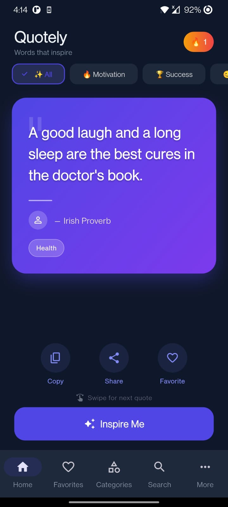
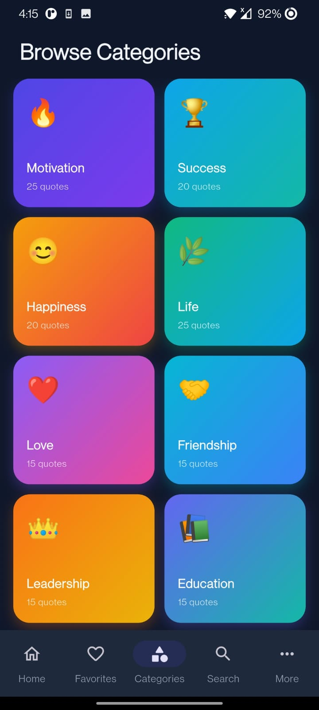
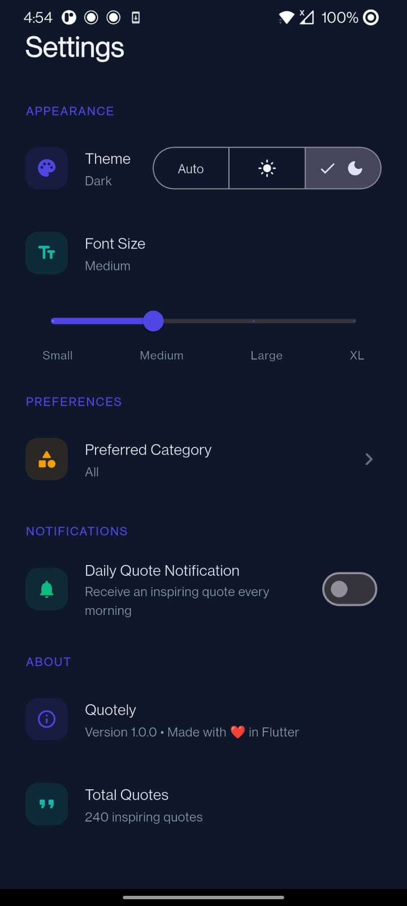
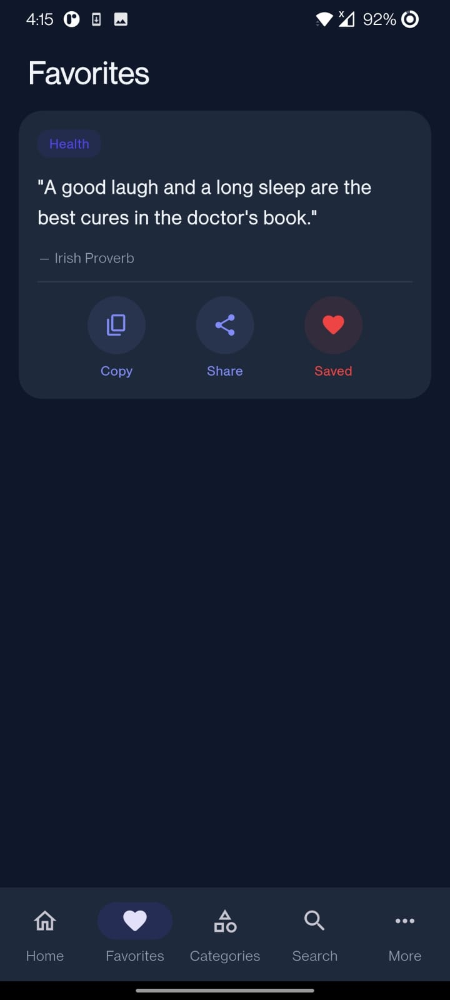

# 📖 Quotely — Random Quote Generator

A premium, modern, and production-ready **Random Quote Generator** built with **Flutter**, **Dart**, **Riverpod**, and **Clean Architecture**.

Quotely is designed to inspire users with carefully curated quotes while demonstrating scalable Flutter architecture, responsive UI design, offline-first storage, and smooth user experience. The application works completely offline and focuses on performance, accessibility, and clean code practices.


---

# 📑 Table of Contents

- Features
- Screenshots
- Color Palette & Typography
- Architecture
- Tech Stack
- Getting Started
- Future Improvements
- License

---

# 🚀 Features

### ✨ Quote Experience

- Instantly generate random inspirational quotes.
- Smooth left and right swipe navigation.
- More than **500+ curated offline quotes**.
- Quote of the Day with deterministic daily generation.
- Search quotes by text, author, or category.

### 📚 Categories

Browse quotes from **13 carefully selected categories:**

- Motivation
- Success
- Happiness
- Life
- Love
- Friendship
- Leadership
- Education
- Programming
- Business
- Health
- Stoicism
- Islamic Quotes

### ❤️ Personalization

- Save favorite quotes.
- View recently opened quotes.
- Daily reading streak tracker.
- Copy quotes instantly.
- Share quotes using native sharing.

### 🎨 User Experience

- Responsive UI for phones and tablets.
- Light Theme
- Dark Theme
- System Theme
- Adjustable font sizes
- Smooth micro animations
- Offline-first experience

---

# 📸 Screenshots

<p align="center">
  
  
  
  
</p>

---

# 🎨 Color Palette

| Color | Hex |
|-------|------|
| Primary | `#4F46E5` |
| Secondary | `#14B8A6` |
| Background (Light) | `#F8FAFC` |
| Background (Dark) | `#0F172A` |
| Success | `#10B981` |
| Error | `#EF4444` |
| Warning | `#F59E0B` |

### Typography

- **Headings:** Playfair Display
- **Body:** Poppins
- **Fallback:** Inter

---

# 🏗️ Project Architecture

The application follows **Clean Architecture**, separating presentation, domain, and data layers to improve scalability, maintainability, and testability.

```text
lib/
├── app/
├── core/
│   ├── constants/
│   ├── theme/
│   └── widgets/
├── data/
│   ├── datasources/
│   └── repositories/
├── domain/
│   ├── entities/
│   └── repositories/
└── features/
    ├── categories/
    ├── daily_quote/
    ├── favorites/
    ├── history/
    ├── home/
    ├── search/
    └── settings/
```

---

# 📦 Tech Stack

## Framework

- Flutter

## Language

- Dart

## State Management

- Riverpod

## Local Storage

- Hive
- Shared Preferences

## Fonts

- Google Fonts

## Animations

- flutter_animate

## Sharing

- share_plus

## Notifications

- flutter_local_notifications

## Utilities

- uuid
- intl

---

# ⚙️ Getting Started

## Prerequisites

- Flutter SDK 3.0 or higher
- Android Studio or VS Code
- Android Emulator or Physical Device

## Installation

### Clone the Repository

```bash
git clone https://github.com/YOUR_USERNAME/quote_app.git
```

### Navigate to the project

```bash
cd quote_app
```

### Install dependencies

```bash
flutter pub get
```

### Analyze the project

```bash
flutter analyze
```

### Run the application

```bash
flutter run
```

---

# 📱 Main Features

- Random Quote Generator
- Quote of the Day
- Category Browsing
- Search Quotes
- Favorites
- History
- Copy Quote
- Share Quote
- Daily Reading Streak
- Offline Support
- Responsive Layout
- Dark & Light Theme
- Font Scaling

---

# 🚧 Future Improvements

- Firebase Authentication
- Cloud Synchronization
- Quote Widgets
- Daily Scheduled Notifications
- User-created Quote Collections
- Multiple Language Support

---

# 🤝 Contributing

Contributions are welcome.

If you'd like to improve this project:

1. Fork the repository
2. Create a feature branch
3. Commit your changes
4. Open a Pull Request

---

# 📄 License

This project is licensed under the **MIT License**.

---

## ⭐ If you found this project useful, consider giving it a star on GitHub!